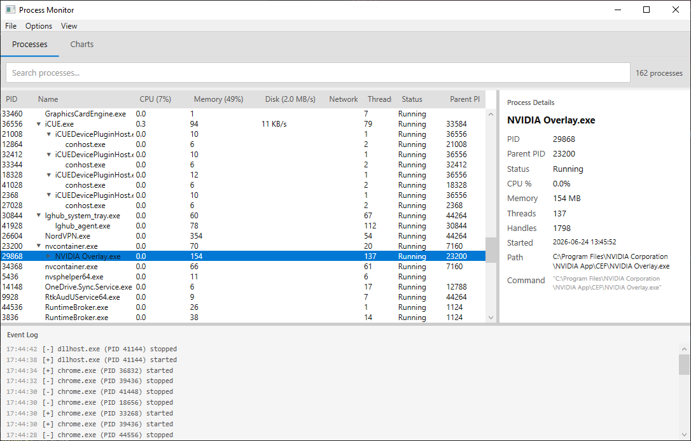
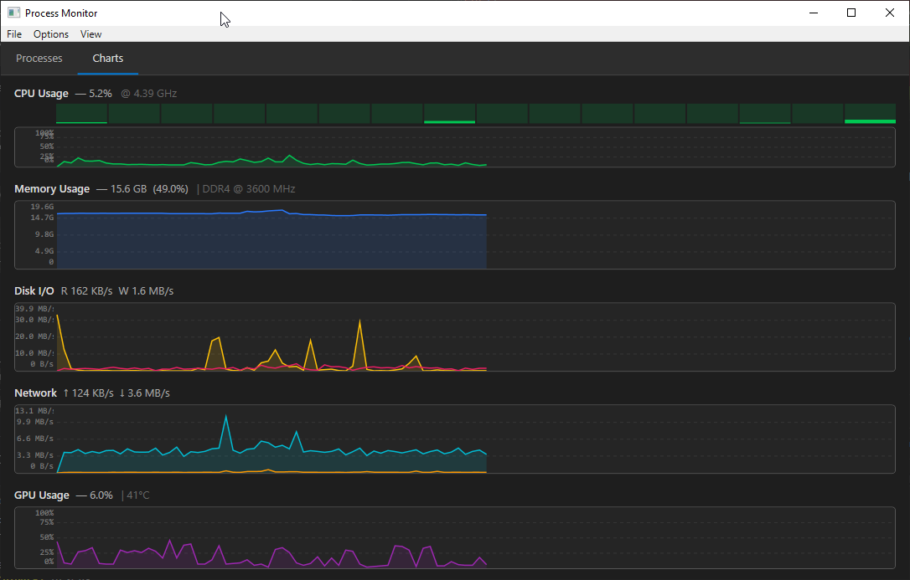
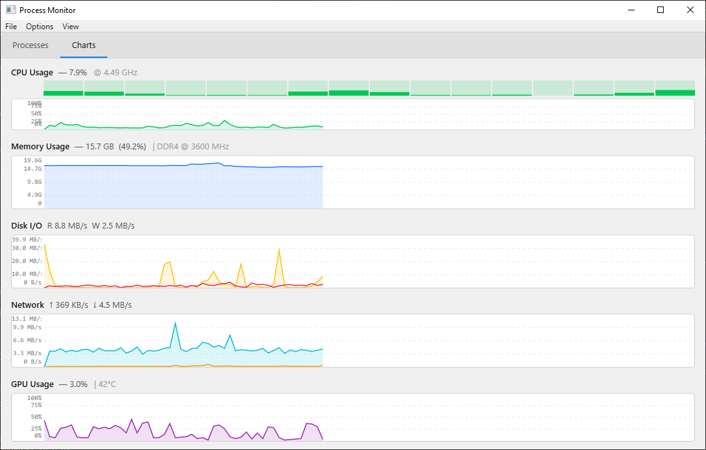

# Process Monitor

## Screenshots

| Processes | Charts (dark) | Charts (light) |
|---|---|---|
|  |  |  |

A Windows process monitor built with WPF and .NET 10, inspired by Task Manager but with a focus on real-time data density and developer-friendly detail. Features a hierarchical process tree, live performance charts, spike detection, and hardware sensor integration.

## Features

### Process List
- **Process tree** — parent/child hierarchy with expand/collapse, subtree resource totals rolled up to parent rows
- **Live columns** — CPU%, Memory, Disk I/O (per-process via kernel I/O counters), Status, Threads, and PID
- **Column header totals** — headers show system-wide usage (e.g. `CPU (15%)`, `Disk (2.3 MB/s)`, `Network (↑1.2 KB/s ↓0.3 KB/s)`)
- **Sorting** — click any column header; sort is tree-aware (subtotals computed before ordering)
- **Search** — `Ctrl+F` to focus the search box; non-matching rows dim to 25% opacity while matches stay highlighted and ancestors are kept visible
- **Spike detection** — rows flash when a process exceeds configurable CPU or memory thresholds; configurable via Spike Settings
- **New / terminated highlighting** — new processes briefly highlight green, terminated processes highlight red

### Process Detail Panel
Selecting a process shows an expandable detail pane with:
- PID, Parent PID, Status, CPU%, Memory, Thread count, Handle count
- Start time, executable path, full command line (fetched lazily on selection)

### Performance Charts
Five real-time scrolling charts rendered directly on WPF `Canvas` elements:

| Chart | Details |
|---|---|
| CPU Usage | Overall %, current GHz, CPU temperature (°C), per-core utilization bars |
| Memory | Used GB/MB, usage %, RAM type and speed (e.g. `DDR5 6000 MHz`) from WMI |
| Disk I/O | Read/write bytes per second (system-wide) |
| Network | Send/receive bytes per second (system-wide) |
| GPU Usage | Overall % and temperature (°C) from LibreHardwareMonitor |

### System Tray
- Minimizes to tray (optional — off by default, toggle under **Options → Minimize to Tray**)
- Tray tooltip shows live CPU, Memory, and GPU stats
- Right-click tray icon → **Show** or **Exit**

### Other
- **Start with Windows** — writes/removes a `HKCU\...\Run` registry entry (**Options → Start with Windows**)
- **Window state persistence** — position, size, maximized state, and selected tab saved to `%AppData%\ProcessMonitor\settings.json`
- **Kill process** — select a row and press `Delete`
- **Export to CSV** — `Ctrl+E` exports the current process list
- **Dark / light theme** toggle under **View → Theme**

## Keyboard Shortcuts

| Shortcut | Action |
|---|---|
| `Ctrl+F` | Focus search box |
| `Escape` | Clear search |
| `Delete` | Kill selected process |
| `Ctrl+E` | Export process list to CSV |

## Requirements

- Windows 10 or later (x64)
- [.NET 10 Runtime](https://dotnet.microsoft.com/download/dotnet/10.0) (or SDK to build)
- Administrator privileges recommended — required for reading handle counts, some process paths, and hardware sensors

## Build

```bash
git clone <repo-url>
cd ProcessMonitor
dotnet build ProcessMonitor.csproj -c Release
```

To produce a self-contained single-file executable:

```bash
dotnet publish ProcessMonitor.csproj -c Release -r win-x64 --self-contained true -p:PublishSingleFile=true
```

The output will be in `bin\Release\net10.0-windows\win-x64\publish\`.

> **Note:** Always pass the `.csproj` filename explicitly. The WPF XAML compiler generates temporary `*_wpftmp.csproj` files during build that can confuse `dotnet` if the project is inferred from directory context.


## Dependencies

| Package | Purpose |
|---|---|
| `LibreHardwareMonitorLib` 0.9.6 | CPU/GPU temperature, GPU usage |
| `System.Diagnostics.PerformanceCounter` 10.0.9 | CPU GHz, per-core usage, disk throughput |
| `System.Management` 10.0.9 | WMI queries (RAM type/speed, process command lines) |
